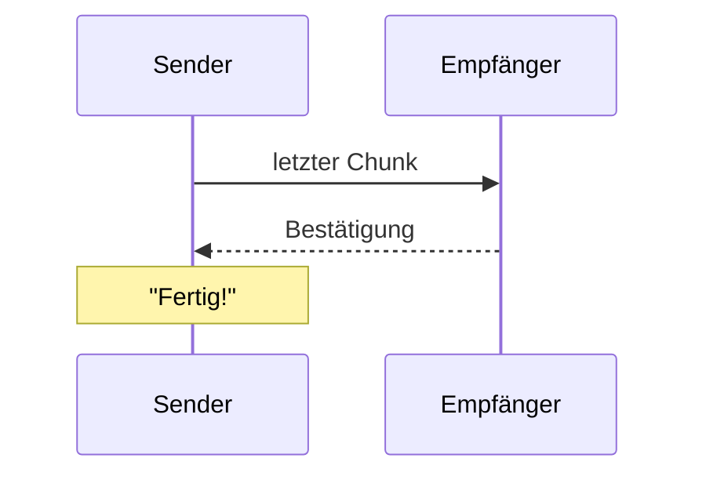

# Pull request

Decides the shape of a pull request or merge request: what the title names, how long the description runs, which picture goes in.
Wording inside it follows [writing-style](../writing-style/SKILL.md).
An issue takes [issues.md](issues.md) instead of the steps below.

The model throughout: PRs and issues a student team wrote by hand for PeerDrop (github.com/bjoern621/PeerDrop, numbers below 250).
They read like a teammate's note to the reviewer.
The reviewer opens the diff next to the description, so the description carries what the diff cannot show.

## 1. Language

Write in the language the project's people write in, read off their recent issue titles, PR titles and commit subjects.
Identifiers, commands and quoted UI strings stay as written.
PeerDrop writes German around English names: "Copy Button für eigenes Token hinzugefügt".

## 2. Title

Name one change in 3 to 8 words, in the form the project's own titles take.

- `wss:// in Production statt ws://`
- `Copy Button für eigenes Token hinzugefügt`
- `Fix für vertauschte Delete-Icon-Farben`
- `Geräte umbenennen`
- `Add /address-mr for one review round on a merge request`

A title needing "and" or a comma to cover the work names two changes.
Split the branch, or name the goal both changes serve.

## 3. Description

Take the smallest rung that carries the change:

1. **Link alone.** Title plus issue say everything: the body reads `Closes #59`.
2. **One to three sentences.** What changes, as the user or the reviewer meets it.
   > Der gesamte TokenContainer ist ein Button, welcher beim Anklicken das eigene Token in die Zwischenablage kopiert.
   > Design wie besprochen durch Icons, die über dem Token angezeigt werden (Token selbst wird geblurred und leicht transparent).
3. **Bullet changelog.** The change lands in several places: one bullet per change, one line per bullet, at most eight.
   > - Zu lange Gerätenamen werden mit `...` abgekürzt
   > - Delete- und Status-Buttons werden nicht verzerrt
   > - Bei zu vielen Geräten erscheint eine Scrollbar nur für die registrierten Geräte

The body opens with the issue link on its own line: `Closes #21` for the issue it finishes, `Siehe #262` or `Part of #262` for one it only touches.

After the rung, add each of these that applies, one or two sentences each:
- **Reason the diff hides.** Why a choice that looks wrong is right, with a link when one explains it.
  > Fälschlicherweise wurden die TURN Server entfernt. Diese wurden wieder eingeführt, warum? Lies nach was TURN macht: https://www.metered.ca/docs/turn-server-service/what-is-turn
- **Open point.** What is still missing and what unblocks it.
  > Aktuell muss noch ein Hash für den OTP Input Style Tag verwendet werden. Dieser sollte eher mit einem Nonce ersetzt werden, ein [Pull Request](https://github.com/guilhermerodz/input-otp/pull/104) muss dafür in die Library gemergt werden.
- **Teammate action.** What somebody does differently from now on, addressed to them.
  > @HomeMichi dadurch sollte der Schritt mit der Datenbank in Rider komplett optional sein. Du kannst jetzt die Docker Compose ausführen und alles sollte sofort funktionieren.
- **Manual check.** Numbered steps when the reviewer has to see the change run to believe it.
- **Design source.** A link to the Figma frame, mockup or issue comment the change implements.

Everything the diff, the CI checks and the issue already show stays there: file lists, the mechanism, build and lint results, acceptance criteria.
A description that fits on one screen without headings needs none.

## 4. Picture

Add the picture the change has, placed right under the sentence it shows:

| Change | Picture |
|---|---|
| Visible UI result | Screenshot of the changed area |
| Visual fix or restyle | Before and after side by side in a two-column table |
| Interaction: hover, animation, drag, a flow across screens | GIF of the interaction |
| Flow, protocol or state change without UI | Mermaid `sequenceDiagram` or `stateDiagram-v2` |
| Bug with a console or log error | The error as a fenced code block |
| CLI output | The output as a fenced code block |

Rename, CI, dependency or refactor work without visible effect goes without a picture.
Capture and upload: [pictures.md](pictures.md).

A before and after pair:

```markdown
| Vorher | Nachher |
|---|---|
|  |  |
```

A flow, rendered natively by GitHub and GitLab:

````markdown

````

## 5. Finished

The PR is finished once:
- the title names one change in the project's language,
- the first body line links the issue, or no issue exists,
- every sentence answers something the diff, CI and issue leave open,
- a change from the first five table rows carries its picture, or the report to the user says which picture is missing and why,
- [writing-style](../writing-style/SKILL.md) has run over title and body.

## Example

A finished description at rung 3 with a teammate action and a picture:

```markdown
Closes #6

- Geräte senden regelmäßig Heartbeats an den Server
- Server leitet Heartbeats an aktive Clients weiter
- WebSocket wird nach dem Login neu aufgebaut


@NovaCaller `NpgsqlDataSource` läuft jetzt als Singleton, neue Repositories bekommen sie per Konstruktor.
```
